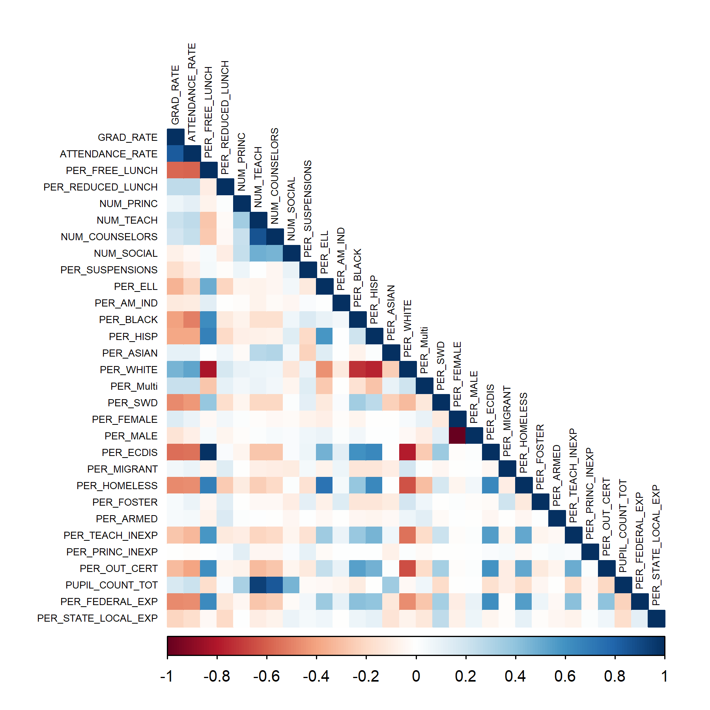
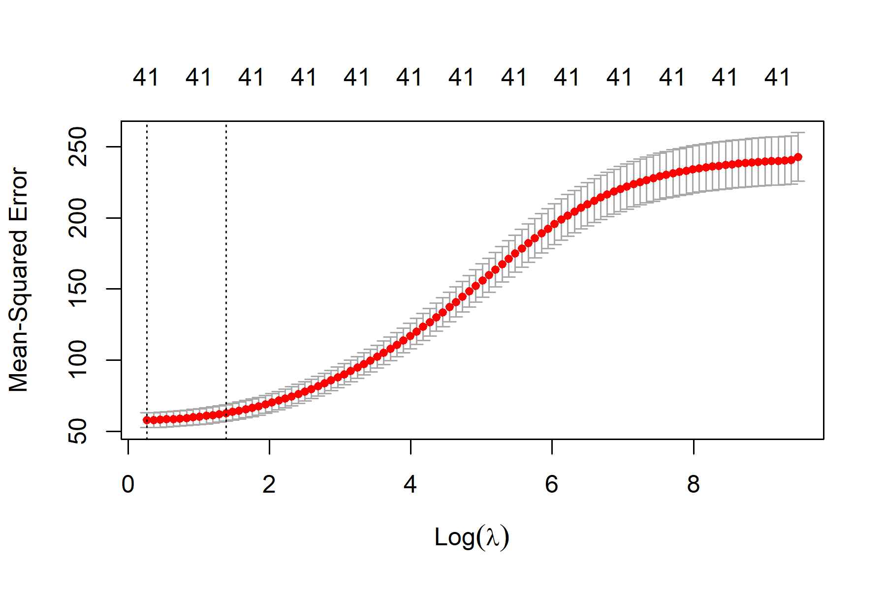
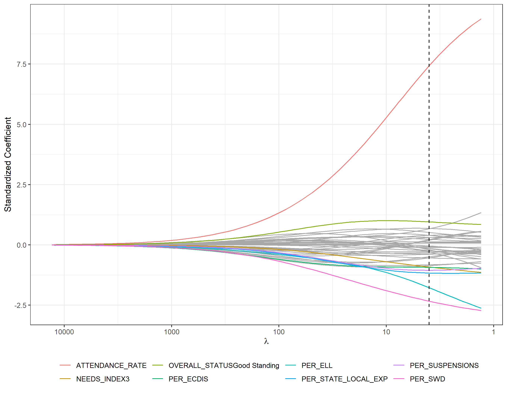
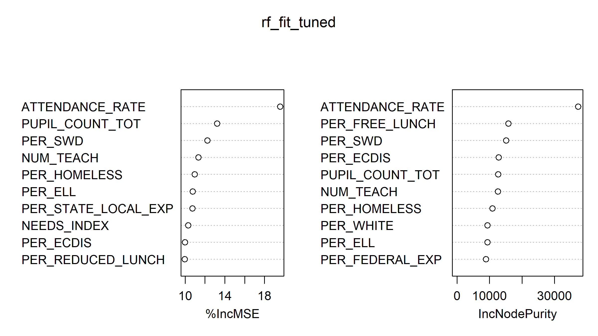
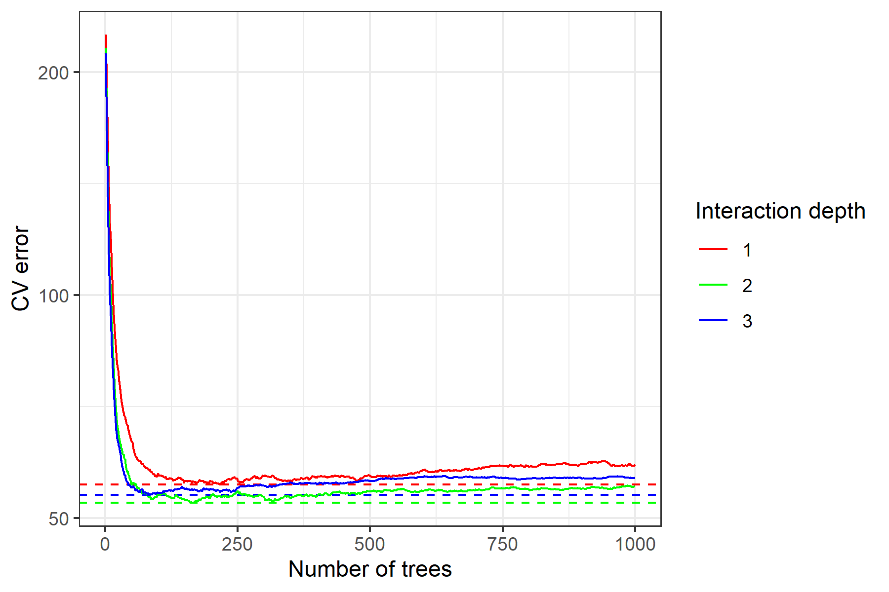

```{r setup, include=FALSE}
options(scipen = 0, digits = 3)  
library(tidyverse)
library(kableExtra)
full_data <- read_csv("../cleaned data/final data/merged data.csv") 
training <- read_csv("../cleaned data/final data/nyschool_train.csv") %>% 
  select(-c(ENTITY_CD, ENTITY_NAME, INSTITUTION_ID))  %>% 
  mutate(OVERALL_STATUS = as.factor(OVERALL_STATUS),
         NEEDS_INDEX = as.factor(NEEDS_INDEX))
```

\bigskip

The code to reproduce this report is available [on Github](https://github.com/jzkuang/Stat471-final-project).

\newpage

# Executive Summary

**Problem.** Graduation rates are one of the most used indications of how well a school is developing their students. Schools are essential to the  growth of people in living morally, creatively, and productively in today's society. Despite the national high school graduation rates hitting all-time highs during recent years, some schools are still not seeing the same success. So, for our final project, we have decided to look into the various measures of schools in New York throughout 2019 and analyze which factors were most predictive of high graduation rates in those schools. These factors inform about areas of focus that will contribute most to a school's success in advancing student achievement. Although we are only exploring data encompassed in New York schools, we believe that our results will be informative of schools in other states and the US due to the variety of schools in New York. 

**Data.** Our datasets are all pulled from the New York State Education Department (NYSED) and merged together to consider the different types of explanatory variable. A large amount of data for high schools in 2020 were missing, so we focused on 2019. These datasets include both public schools and charter schools and statistics regarding each school's categorized standing, funds and expenditures, characteristics of the staff and students, and the overall demographics of the student population. Our primary response variable will be graduation rate, an illustrative factor of a school's student development.

**Analysis.** Before exploring our data or analyzing it, we split our data into a training and testing dataset, where the testing dataset is utilized for assessing and comparing our statistical model performances. Then, we explore the data to summarize the main characteristics and learn of any correlations between variables. We built 3 different predictive models: ridge regression, random forest, and boosting. To determine which model was the best predictor, we calculated the root mean squared error for each model, and we determined that the boosting model had the lowest test error. 

**Conclusions.** We found that the boosting model had the best performance compared to random forests and the ridge regression. All three methods suggested very similar variables for the most important in determining the strongest predictors of graduation rate. Our optimal boosted method showed that variables related to the students were the most significant predictors of graduation rate, especially the attendance rates, compared to the other variables. We hope that our analysis and results can help determine areas of focus for educational policy in New York, with the ultimate goal of improving the development and education of students in the US.

# Introduction

**Background.** High schools are designed as a center of education and development for their students, and their success can oftentimes be measured by their graduation rates. The importance of high school graduation can never be underestimated, as those who graduate can expect better opportunities in their future. The overall graduation rates of high schools in the US has been gradually increasing and reaching all time highs in recent years at 88% for the 2018-2019 academic year. However, high schools that are most successfully getting students through graduation are spread across certain states, and the average state graduation rates can dip down to as low as 75% as a result.^[See High School Graduation Rates By State (2021). usnews.com/education/best-high-schools/articles/see-high-school-graduation-rates-by-state.] Moreover, although overall graduation rates in the US are at all-time highs, there are still states in the US struggling to achieve that same success.   

In addition, the number of individual schools that are considered federally as having low graduation rates, or schools of 100 or more students where fewer than two-thirds earn diplomas in four years, have not been decreasing as overall graduation rates improve. In fact, the number had actually increased in 2016, revealing that it is currently incredibly important to develop methods of improving less successful schools.^[Number of High Schools With Low Graduation Rates Is Rising (2018). https://www.edweek.org/teaching-learning/number-of-high-schools-with-low-graduation-rates-is-rising/2018/06.] 
These large disparities in graduation rates should be a concern within educational policy, and the solution isn't as easy as simply increasing funding. Many schools are limited in resources, so it is important to identify features that are most predictive of graduation rates. Furthermore, a thorough analysis of graduation rates and their respective schools will highlight the key qualities of schools with high graduation rates. 

**Analysis goals.** Many factors are considered to be indicative of a quality high school, such as teacher/student ratios, effective school leadership, and a supportive teaching environment. Furthermore, by building statistical models, we seek to investigate how important these different features are in determining a high school's graduation rate. We hope to find which types of school features are most predictive of graduation rates, and determine whether these features can be targets of improvement, as variables like student demographics of a school are not feasible to change.

**Signficance.** Our analysis will contribute to finding ways of improving our education system by finding features that are most important to graduation rates. These findings will produce targets for development and reform in our schools, ultimately with the goal of improved student development and opportunities in our society. 

# Data

## Data Sources

Our dataset is a combination of several publicly available datasets from the New York State Education Department's website (data.nysed.gov). Given our purpose, we decided on the Student and Educator Database, the Enrollment Database, and the Report Card Databases for the 2019-2020 school year. These datasets are centered around proving information about the ~1300 high schools as well as a scattering of schools serving other grade levels in the state of New York. This data is collected by the state specifically for parents and, thus, is focused towards featuring data points, such as class size and budget, that would be of interest to parents.

The first dataset, the Student and Educator Database, possesses information on the number of each staff, the attendance rate, the suspension rate, and the percentage of free/reduced price lunch students. The second dataset, the Enrollment Database, has demographic data for each school. For example, this dataset lists the percentage of parents whose parents are in the armed forces. The final dataset, the Report Card Database, hosts information on the number of teachers out of certification or inexperienced, fiscal data concerning school budgets, the status of each school, and, most importantly, graduation rate which is our response variable.

## Data Cleaning

We downloaded the data from the data.nysed.gov, but it came in the form Microsoft Access Databases. We manually had to extract the data into excel files preserving column names. On the extracted data, we filtered for data only from 2019. The team made this choice after noticing that much of the 2020 data was incomplete, likely an artifact of delays on the end of NYSED. There were also several columns that were missing most if not all of their data. We decided to also remove those features. Further, some datasets had data for each demographic group within the school in addition to numbers for the entire student body. As this was only present in some of the data, we decided to use only observations for entire school bodies. Some observations were also for broader entities than a single school, such as a county school district, and was similarly removed. Once we had filtered the data, we merged them together using the Entity_CD (a code for schools) identifier. However, there were a scattering of NA/missing values that still needed to be dealt with. First, we, through a combination of prudent use of left merging and filtering, preserved only data with a reported graduation rate. Second, we imputed missing values for the total count of pupils, the percentage of federal expenditures, and percentage of state/local expenditures for a school using the mean. 

## Data Description

### Observations

Our dataset was comprised of 1201 observations, each corresponding to a high school in New York State during the year of 2019.

### Response Variable

Our response variable is the graduation rate for each of our schools.

### Features

Drawing on data from the New York State's Department of Education, we included 31 variables in our analysis. These variables can be separated into two broad categories: features involving the school and features involving students. The school features can be further subdivided into school standing, expenditure related, and staff count variable groups, while the student features can be subdivided into characteristic and demographic features. All of the variables are numeric except for Overall Status and Needs Index. For a detailed specification of each variable, refer to Appendix \@ref(appendix).

## Data Allocation

We used an 80-20 train-test split for our modeling. 

## Data Exploration

### Response

The first thing that our team wanted to explore is the response variable, i.e. graduation rate.

```{r eda-gr-hist, fig.width = 4, fig.height= 3, out.width= "60%", fig.align= 'center', fig.cap="Distribution of the Graduation Rate", fig.pos="h", echo=FALSE}

```

To that end, we produced a histogram out of our data's training rate (Figure \@ref(fig:eda-gr-hist)). From the histogram, we can see that the data is negatively skewed. Most high schools have an above 75% graduation rate, but there are a few schools that are very poor performers. The mean graduation rate for the training data is `r mean(training$grad_rate)`, and the standard deviation of the graduation rate is `r sd(training$grad_rate)`. 

```{r worst-schools, echo=FALSE}
# Which schools are the lowest?
full_data %>% 
  select(ENTITY_NAME, GRAD_RATE) %>% 
  arrange(GRAD_RATE) %>% 
  slice(1:15) %>% 
  rename(
    "School" = ENTITY_NAME,
    "Graduation Rate (Percent)" = GRAD_RATE
  ) %>% 
  kable(format = "latex", row.names = NA,
      booktabs = TRUE, digits = 2,
      caption = "The Worst Performing Schools") %>%
  kable_styling(position = "center", latex_options = "HOLD_position")
```

Table \@ref(tab:worst-schools) shows us the fifteen schools with the worst graduation rates. The schools are a motley mix from across the state. However, Brooklyn and Bronx stand out as a district with the most schools on this list. This isn't unexpected given that NYC and the state tend to under invest in those areas.

### Features

Next, we explored the features of our dataset more depth. 

```{r eda-cv, echo= FALSE}
stand_sd <- function(vector){
  return (sd(vector)/mean(vector))
}
training %>% 
  select(-GRAD_RATE) %>% 
  summarise_if(is.numeric, stand_sd) %>% 
  pivot_longer(everything(), names_to = "Variable", values_to = "Coefficient of Variation") %>% 
  arrange(desc(`Coefficient of Variation`)) %>% 
  slice(1:10) %>% 
  kable(format = "latex", row.names = NA,
      booktabs = TRUE, digits = 2,
      caption = "Ten Highest Coefficient of Variations") %>%
  kable_styling(position = "center", latex_options = "HOLD_position")
```
First, we wanted to see what the variation is like within our features. To that end, we created Table \@ref(tab:eda-cv), which displays the variables with the ten highest coefficient of variations (i.e. standard deviation divided by mean). We can see that the most variable features tend to be demographic ones (percent of students with parents in the Armed Forces and percent of students who are migrants being the top two). This makes a bit of intuitive sense. Some NY schools will be comprised mostly of a single demographic, e.g. students with parents in the Armed Forces, while others will have that demographic completely missing. This leads to a high variation among schools in demographic factors.

```{r eda-cm, fig.width = 8, fig.height= 8, out.width= "80%", fig.align= 'center', fig.cap="Correlation Matrix", fig.pos="H", echo=FALSE}

```
In Figure \@ref(fig:eda-cm), we can see how these different features correlate with one another as well our response variable. As expected, most of the demographic features are very closely correlated with one another. For example, percent female students and percent male students have almost a perfect negative correlation for obvious reasons. More interesting are the features that correlate with one another with a less blatantly obvious connection and also the absence of correlation for some features. There is a heavily negative correlation between percent of students who are white and the percent of students who are on free lunch. This, of course, makes intuitive sense given the racial dynamics of the United States. In fact, many of the features that we expect to be common in worse schools correlate negatively with the percent of students who are white at a school. The percent who are out of certification and who are inexperienced for example are negatively correlated. We, on the other hand, don't see much if any correlation between the number of students at a school with and any of the other features that aren't relate to staff counts. So, whiter schools aren't smaller nor are more Asian schools larger. 

```{r corr-gr, echo = FALSE}
training %>% 
  select_if(is.numeric) %>% 
  cor() %>% 
  as.data.frame() %>% 
  select(GRAD_RATE) %>% 
  arrange(desc(abs(GRAD_RATE))) %>% 
  slice(2:11)  %>% 
  kable(format = "latex", row.names = NA,
      booktabs = TRUE, digits = 2,
      caption = "Ten Highest Correlations With the Response Variable") %>%
  kable_styling(position = "center", latex_options = "HOLD_position")
```
We can also explore the correlation with the response variable and our feature variables. The ten top variables most, negatively or positively, correlated with graduation rate are shown in Table \@ref(tab:corr-gr). The features that we expect to see appear with the respective signs. Attendance rate is the most correlated, which makes sense. After all, you can't graduate if you don't go to school. We also see economic variables indicating poverty (precent of students with free lunch, percent who are economically disadvantaged, and percent homeless) do negatively correlate with graduation rate. Poorer students having more difficulty graduating is a logical story. Poorer students are also more likely to attend worse schools. Interestingly, per pupil expenditure using federal funds correlates negatively with graduation rate. We expected the opposite relationship. More money should equal better results! Perhaps, the worse schools or the poorest receive the most federal funding. That would explain the relationship, but, without more knowledge on how federal funding is distributed, we can not make a definite conclusion.

# Modeling

## Regression-Based Models
We first wanted to create a baseline for our expectations for the analysis. Thus, we thought that using a linear regression would be a perfect first step. Regressions are quite simple, with most guessing values by multiplying coefficients to their respective features and adding an intercept.  However, we were worried that there might be some overfitting so we wanted to have a penalty term. We decided on using a linear ridge regression for two main reasons. First, we only have thirty one variables while over a thousand observations. There is not a huge need to pare down the number of features that we have even when accounting for the indicator variables that our categorical variables will split into. Second, we have several features that are highly quite correlated with one another. Lasso regressions are unstable when they are faced with such variables (choosing one or the other in a basically random manner), while ridge regressions tend to simply split the coefficients.

```{r rr-training, fig.width = 4.5, fig.height= 4, out.width= "60%", fig.align= 'center', fig.cap="Cross Validation Plot for Linear Ridge Regression", fig.pos="H", echo=FALSE}

```

The major turning parameter for ridge regressions is lambda, which decides how much we penalize the regression for each coefficient. The higher the lambda is the more basic the model. To choose our lambda, we created our shrinkage model under a 10-fold cross validation. We used the one-standard error rule to pick the best lambda, 3.99, for testing. This small lambda seems best even given that there is little apparent overfitting at the start of the model as seen in Figure \@ref(fig:rr-training). 

```{r rr-var-import, fig.width = 5.5, fig.height= 5, out.width= "70%", fig.align= 'center', fig.cap="Feature Importance Plot for Lienar Regressions", fig.pos="H", echo=FALSE}

```

With the lambda chosen, we can create the model with from which we are going to get our test RMSE. Figure \@ref(fig:rr-var-import), shows not only that model (the one at the dotted line) but also the growth of the model as the penalty error term gradually decreases. We have also highlighted the eight most impactful variables, and we can see the exact values of their coefficients in Table \@ref(tab:lr-coefs). As a note, these coefficients have been standardized, and so are not reflective of absolute values of their respective features.

```{r lr-coefs, echo=FALSE, message = FALSE, warning = FALSE}
load("../results/lr_std_coefs.RData")
std_coefs %>% 
  slice(1:8) %>%
  kable(format = "latex", row.names = NA,
      booktabs = TRUE, digits = 2,
      caption = "Ten Highest Correlations With the Response Variable") %>%
  kable_styling(position = "center", latex_options = "HOLD_position")
```


It should come as no surprise that attendance rate is the most important coefficient (by a wide margin too). Even in the exploratory data analysis, we noted that attendance rate was highly correlated with graduation rate. That it has such a large impact, even with ridge penalty, shows just how important the feature is to the model. The rest of the top eight features, however, were less noticed in our early data exploration. The second high feature is percent of students with disabilities. This makes sense (it is harder to do school with a disability), but it is disappointing to see it make such a high difference. Having more people who need to learn English leading to lower graduations rates is similarly expected but disappointing. Surprisingly, the state/local spending more money on a school indicates a lower graduation rate. This is a rather confusing result. In the early data exploration, we did note that federal expenditure was also negatively correlated, but that was on its own. This model should account for the confounding variables that could have led to the federal expenditure result. Perhaps, though this is part of the problem. The model could have a multicolinearity problem with multiple other variables correlating enough with per pupil state/local expenditures to return this unintuitive result. The rest of the variables, however, don't seem to have this problem with relatively intuitive explanations. For example, suspensions increasing meaning lower graduation comes as no surprise to anyone.

It is important to remember the purpose of the linear ridge regression model. It serves as our baseline for the more advanced models. To that end, it will be interesting to see if the variables in this model remain impactful in others or if they were merely an idiosyncrasy of linear ridge regressions. It will also be interesting to compare the test error of linear ridge regressions with other regressions.

## Tree-Based Models
After modeling our data using regression-based models, we decided to used the more powerful and better predicting tree-based models. Although tree-based models can be unstable and worse at predicting certain sets of data, we believe that the high interpretability of this prediction method will be able to uncover the most important factors in determining graduation rate of high schools.

### Random forest
Random forests represent one tree-based model that have been shown to perform exceptionally in certain sets of data. They use a random subset method and bagging in order to prevent overfitting, which gives it great predictive power. One issue with random forests is their lack of precision in predicting continuous response variables depending on how well the true model fits a tree-based approach. However, it is important to test and analyze the predictive power of the random forest because of its proven predicting power. 

Moreover, there are methods of tuning the random forest to build better random forests that are catered to our data. Although random forests have low interpretability compared to some tree-based models, it measures variable importance which is valuable for our purposes in learning the most important factors for school graduation rates.  

```{r rftuning, fig.cap = "Tuning the value for m in a random forest model", fig.align='center', echo = FALSE, fig.pos="H"}

```

We tuned our random forest models based on variable m: the subset of features at each split point of the tree. By tuning against out-of-bag error, we determine an optimal m-value, as shown in Figure \@ref(fig:rftuning). The value that minimized the OOB error was 3, which is lower than the default m value of 10. With this tuned parameter, we are able to build a better random forest, and this random forest when checked against number of trees to ensure had an out-of-bag error that was stabilized. 

```{r rfimportance, fig.width = 7, fig.height= 6, out.width= "80%", fig.cap = "Plot of the variable importance using the purity based importance (on the right) and the OOB prediction based importance (on the left).", fig.align='center', echo = FALSE, fig.pos="H"}

```
Then, we calculate the levels of variable importance using the tuned random forest as shown in Figure \@ref(fig:rfimportance). The clear most important variable in this random forest is the attendance rate of students at the school. This variable has a much higher value than the rest on both measures of importance, indicating that it is incredibly important to the model and calculating graduation rates. This makes sense because attendance is important to doing well in school, so schools with higher attendance rates tended to have more students perform better and graduate.

For the the OOB prediction based importance, the top three measures were attendance rate, total pupil count, and percent of students with disabilities. For the purity based importance, the top three were attendance rate, percent free lunch, and percent students with disabilities. Although not as important as attendance rate, the other three variables we see are indicative of graduation rate. It's not clear how these variables might impact graduation rate, so we extracted the five lowest graduation rates and their respective variables in Table \@ref(tab:lowgrad). It appears that low graduation rates correspond to lower total pupil counts, higher percent of students with disabilities, and higher percent with free lunch. However, the correlation between these variables and graduation rate isn't incredibly strong and this table does not provide the best explanation due to other factors that contribute to the school's graduation rate, which the table omits. Still, this table can shine some light into how these important variables might impact the graduation rate.

It might make sense that the percent of students with disabilities might be indicative of graduation rates because more students with disabilities might signal a lower socio-economic area, meaning that the school would have less funding and overall worse graduation rates. Similarly, higher percentages of students with free lunch might also be indicative of low graduation rates because of the overlying factors of lower economic status. 

```{r lowgrad, message = FALSE, echo=FALSE}
read_tsv("../results/data_importance.tsv") %>%
  kable(format = "latex", row.names = NA, 
        booktabs = TRUE, digits = 2, 
        col.names = c("Graduation Rate", "Total Pupil Count", 
                      "Percent SWD", "Percent Free Lunch"),
        caption = "The 5 lowest graduation rates and their total pupil count, 
        their percent students with disabilities (SWD), and their percent 
        students with free lunch.") %>%
  kable_styling(position = "center")
```

### Boosting
Boosting (gradient boosting) is another powerful tree-based method that we will be building based on these New York high schools graduation rates. This method is known for building great models and models that are better than even random forests. It also works well with continuous response variables, such as the graduation rate in our case. The model also reveals which variables are most important in determining graduation rate, as well as partial dependence plots to go alongside. So, we use boosting in order to build a model that will have great predictive power for graduation rates and will also highlight the important variables that we must consider. 

```{r gbmtune, fig.width = 4, fig.height= 3, out.width= "60%", fig.cap = "The cross-validation error is plotted against the number of trees for the gradient boosting method.", fig.align='center', echo = FALSE, fig.pos="H"}

```

We tune the boosting model by using different interaction depths for the model, 1, 2, and 3, by plotting cross-validation error against the number of trees. We then choose the model with the lowest minimum CV error, which is the interaction depth of 2. Then, we use that point to identify the minimum number of trees, which is 135 trees. The plot to identify these values can be found in Figure \@ref(fig:gbmtune). With these two tuned parameters, we build a strong predictive model using the gradient boosting method.

This tuned model can also reveal the importance of certain variables, as shown in Table \@ref(tab:gbmimportance). Similar to variable importance measures in the random forest model, we see that attendance rate is by far the most important variable for graduation rate. It is also similar by showing that the top three were attendance rate, percent free lunch, and percent students with disabilities. 

```{r gbmimportance, message = FALSE, echo = FALSE}
read_tsv("../results/gbm_importance.tsv") %>%
  kable(format = "latex", row.names = NA, 
        booktabs = TRUE, digits = 2, 
        col.names = c("Variable", "Relative Importance"),
        caption = "Importance of variables in the boosting model.") %>%
  kable_styling(position = "center")
```

```{r partialdependence, fig.cap = "The partial dependence plot of the three most important variables in the boosting model.", fig.align='center', echo = FALSE, fig.pos="H"}

```

The benefit that boosting has over random forests is the ability to make partial dependence plots to determine how these variables effect the graduation rate. As shown in Figure \@ref(fig:partialdependence), we see that attendance rate increasing corresponds to increased graduation rates. Higher total pupil counts corresponds to higher graduation rates and higher percent of students with free lunch corresponds to decreased graduation rates. These correlations make intuitive sense, as described in the random forest variable importance explanation.

# Conclusions
```{r rmse, message = FALSE, echo = FALSE}
read_tsv("../results/rmse_table.tsv") %>%
  kable(format = "latex", row.names = NA, 
        booktabs = TRUE, digits = 2, 
        col.names = c(" ", "Linear Regression", "Random Forest", "Boosting"),
        caption = "Model evaluation using the test root mean squared error.") %>%
  kable_styling(position = "center")
```
## Method comparison

Table \@ref(tab:rmse) shows the test root means squared error (RMSE) for all three models. The boosting model had the lowest test error with 6.10, followed by linear ridge regression at 6.93, and random forest model performed the worst 6.10. Overall, these errors were quite small, especially due to the large range of graduation rates present in the data. In addition, these results are reasonable because we would expect the boosting model to perform the best since it requires the most tuning and the most computational power. Despite requiring more compuational power, the random forest model performed worse than the linear regression model. This is likely because random forests have difficulty modeling against continuous response variables due to being a tree-based method. Consequently, it can't predict the true model for graduation rates well. 

In addition each model also had very similar identification of the most important variables for predicting graduation rates. Attendance rate was the clear most important explanatory variable in all three models. In addition, generally variables reflecting low socioeconomic status within the student demographics held high importance as well, such as percent students with free lunch being in the top three for each model. These variables would make intuitive sense to be the most important. Greater attendance rates lead to more student participation and learning in school and generally better graduation rates as a result. Low socioeconomic status within the school would lead to less resources for the students and the school, which would suggest low graduation rates. Total pupil counts were also important variables in both tree-based methods, which isn't entirely intuitive. This might suggest that larger amounts of students may allow students to interact and engage more in learning with each other, possibly leading to higher graduation rates. However, these variables are all correlational, so these suggestions are all hypothetical.

## Takeaways

## Limitations

### Dataset limitations 

The largest limitation with the data we collected is that it only includes schools from New York. This means that our results' applicability to other states and the US as a whole will be limited. In addition, our data was missing many schools in the year 2020, so we were forced to choose data from 2019 in order to have a more complete analysis of the different types of schools a state may have. This large dataset is necessary to reduce potential variability that selecting only schools from 2020 might have. In addition, by having a large amount of schools, we hope that the variability in these types of schools might make our results more applicable to other states and the US as a whole. Another limitation in our data is that we did have some NA values for multiple categories, which we filled in using averages if it was a continuous variable and "MISSING" if it was a categorical variable. Lastly, our explanatory variables did have correlation between them. Our models generally assume that each variable is independent of each other, so dependence between variables can lead to issues in the model and interpreting results. For example, collinearity can be problematic in linear regression models, where certain variables are marked as important but are actually part of a larger group of variables that are all dependent of each other.

### Analysis limitations

The models we built all relied on randomness based on a set seed, and we might have obtained different results if we used a different seed. This might mean that running these models again in the same manner may lead to different results, different important variables, and different evaluations of the models' predictive power. The number of schools in our test data was also relatively low (240 schools), so our test data may have large amounts of variability. In addition, the explanatory variables that we used were limited, where we were only able to consider 32 variables. This means that our data is missing many other factors that play important roles in schools and may show more importance in predicting graduation rates. For example, our data didn't include things like socio-economic factors about the students and their families. These are incredibly important variables that should be very important to graduation rates. Moreover, many of our variables are dependent on those socio-economic factors, such as percent students with free lunch. As a result, the variables we found to be most important in our results may just be dependent on a confounding variable that we were not able to consider. 

## Follow-ups

Due to the limitations with our data and analysis methods, more current data and extensive methods will help to illustrate the variables that are most important to graduation rate. In addition, more data should be collected on the schools from other states in the US in order to increase the applicability of the data analysis. It might also be enlightening to collect data for high schools from other countries and to compare those results to our analysis of schools in the US. Furthermore, analyzing data sets from the most successful countries in the world with data for US schools may reveal how other countries develop exemplary education systems. Finally, data from other important variables, such as socio-economic factors should be collected in order to better understand the factors that influence graduation rates. Ultimately, there are many variables that might influence student performance, and it is important to understand what these variables might be.

\appendix

# Appendix: Descriptions of features {#appendix}
Below are the 31 features we used for analysis. Words written in parentheses represent variable names. Unless noted otherwise, all variables are continuous.

**Schools**

- *School Standing*
  - Overall Status (`OVERALL_STATUS`): The status of the school: Good Standing, Targeted Support and Improvement,
Comprehensive Support and Improvement, Closing/Closing School. (Categorical variable)
  - Needs index (`NEEDS_INDEX`): Need-to-Resource Capacity Category. The need-to-resource capacity (N/RC) index is a measure of a district’s ability to meet the needs of its students with local resources. (Categorical variable)

- *Expenditures*
  - Federal expenditures (`PER_FEDERAL_EXP`): Per pupil expenditures using federal funds
  - State and local expenditures (`PER_STATE_LOCAL_EXP`): Per pupil expenditures using state and local funds

- *Staff*
  - Number of teachers (`NUM_TEACH`): Number of teachers as reported in the Student Information Repository
System (SIRS), used for determining the percent of inexperienced teachers
  - Number of principals (`NUM_PRINC`): Number of principals as reported in the Student Information Repository
System (SIRS), used for determining the percent of inexperienced principals
  - Number of counselors (`NUM_COUNSELORS`): Total number of school counselors
  - Number of social workers (`NUM_SOCIAL`): Total number of social workers
  - Percent teacher inexperience (`PER_TEACH_INEXP`): Percent of teachers with fewer than four years of experience in their
positions
  - Percent principal inexperience (`PER_PRINC_INEXP`): Percent of principals with fewer than four years of experience in their
positions
  - Teachers teaching out of certification (`PER_OUT_CERT`): Percent of teachers teaching out of their subject/field of
certification

**Students**

- *Characteristics*
  - Attendance rate (`ATTENDANCE_RATE`): Annual attendance rate
  - Percent suspended (`PER_SUSPENSIONS`): Percent of students suspended
  - Percent reduced lunch (`PER_REDUCED_LUNCH`): Percentage of enrolled students eligible for reduced-price lunch
  - Percent free lunch (`PER_FREE_LUNCH`): Percentage of enrolled students eligible for free lunch
- *Demographics*
  - Percent female (`PER_FEMALE`): Percent of female students (K-12)
  - Percent male (`PER_MALE`): Percent of male students (K-12)
  - Percent American Indian (`PER_AM_IND`): Percent of American Indian or Alaska Native students (K-12)
  - Percent Black (`PER_BLACK`): Percent of Black or African American students (K-12)
  - Percent Asian (`PER_ASIAN`): Percent of Asian or Native Hawaiian/Other Pacific Islander students (K-12)
  - Percent Hispanic (`PER_HISP`): Percent of Hispanic or Latino students (K-12)
  - Percent White (`PER_WHITE`): Percent of White students (K-12)
  - Percent Multi (`PER_MULTI`): Percent of Multiracial students (K-12)
  - Percent English language learners (`PER_ELL`): Percent of English Language Learners (K-12)
  - Percent with disabilities (`PER_SWD`): Percent of students with disabilities (K-12)
  - Percent economically disadvantaged (`PER_ECDIS`): Percent of economically disadvantaged students (K-12)
  - Percent migrants (`PER_MIGRANT`): Percentage of migrant students (K-12)
  - Percent homeless (`PER_HOMELESS`): Percent of homeless students (K-12)
  - Percent foster care (`PER_FOSTER`): Percent of students in foster care (K-12)
  - Percent parent armed forces (`PER_ARMED`): Percent of students with a parent on active duty in the Armed Forces (K-12)

  
